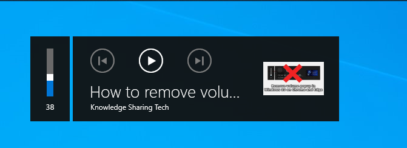

Date: 14 Feb 2023

# Remove the annoying volume popup overlay

**Edge** : search `edge://flags` > search for `Hardware Media Key Handling` > `Disable` it  

**Chrome** : same as edge but just search for `chrome://flags`

**Firefox** : search `about:config` > search for `media.hardwaremediakey.enabled` > make it `false`

**Result**

